# Ascend System - Architecture and Functional Flows

## Namen

Ta dokument je tehnicni blueprint za zacetek implementacije. Bralec naj po branju razume, katere komponente potrebujemo, kako podatki tecejo skozi sistem in kako se izvajajo glavne funkcionalnosti.

Primarni bralec je prihodnji razvijalec aplikacije. Glavna akcija po branju: zaceti graditi Expo/Firebase projekt brez ponovnega odpiranja produktnih odlocitev.

## Arhitekturna nacela

- Offline-first za dnevne queste, dnevnik in vodene vaje.
- Cloud sync za profil, zgodovino, XP, ranke, AI memory in web dashboard.
- Vse obcutljive zunanje integracije tecejo prek backend sloja.
- AI nikoli ne klice aplikacija direktno; klici gredo prek server-side funkcij.
- Health vir mora biti zamenljiv: rocni vnos, Health Connect, Garmin API ali kasnejsi vir.
- Quest generator zacne kot deterministicen rule engine, AI najprej razlaga in personalizira, ne odloca vsega sam.
- Anime RPG UI je predstavitveni sloj; jedro logike mora ostati testabilno in neodvisno od animacij.

## System context

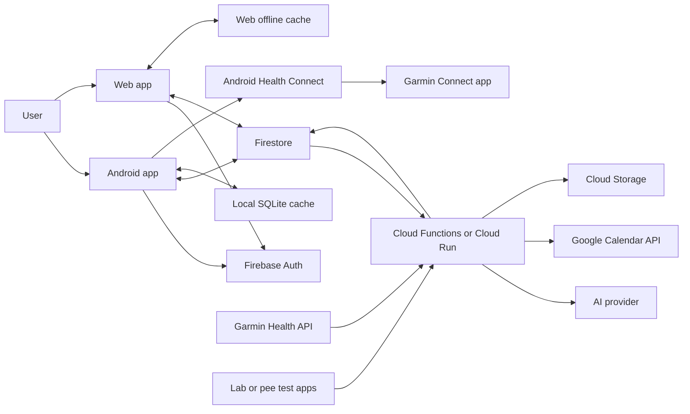

## Target architecture

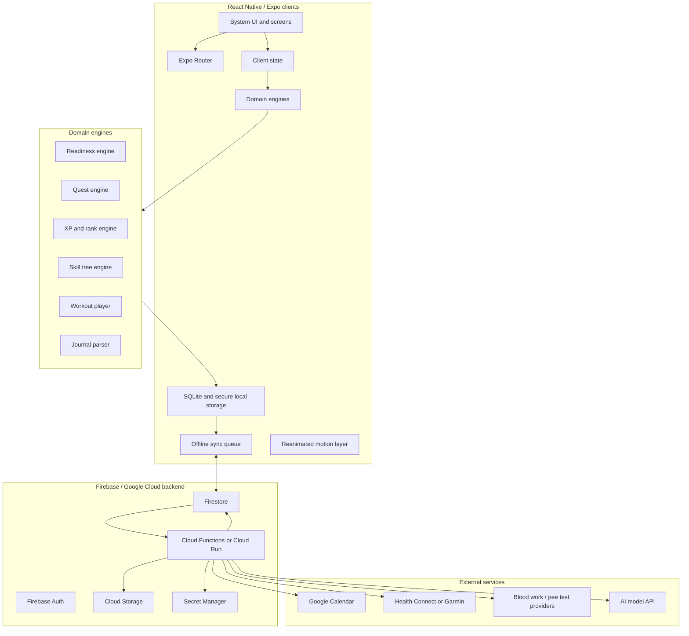

## Client module map

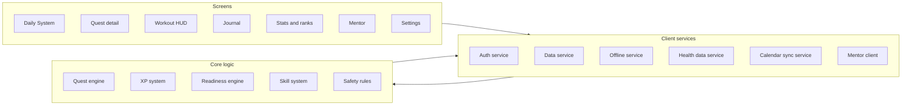

## Backend module map

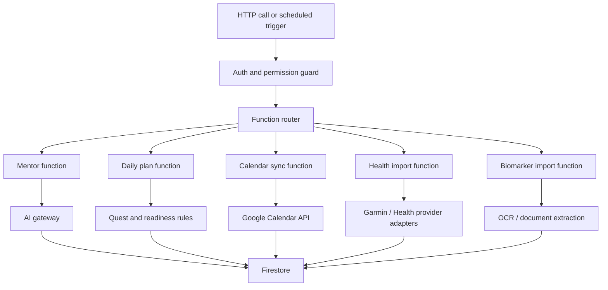

## Core data model

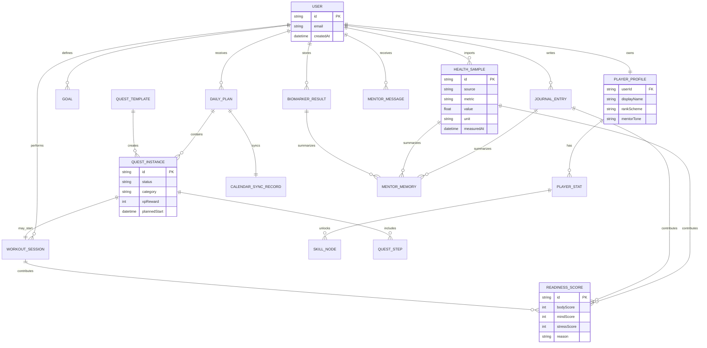

## Podatkovne meje

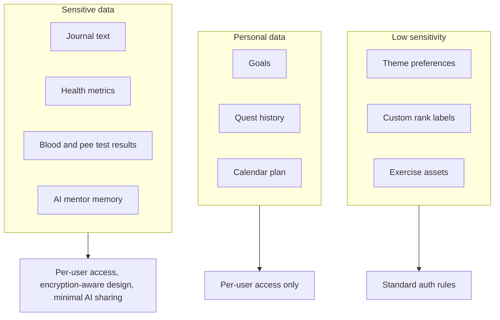

## Daily plan flow

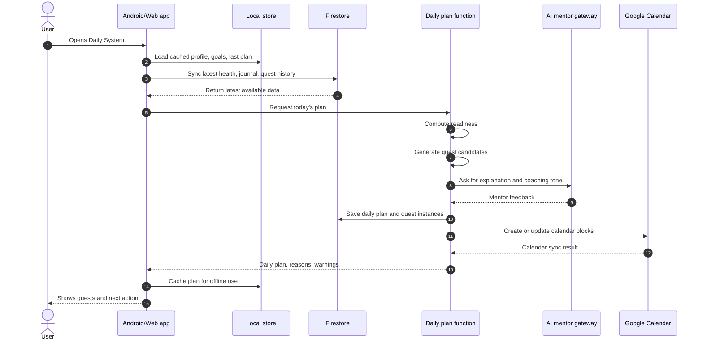

## Readiness and quest selection

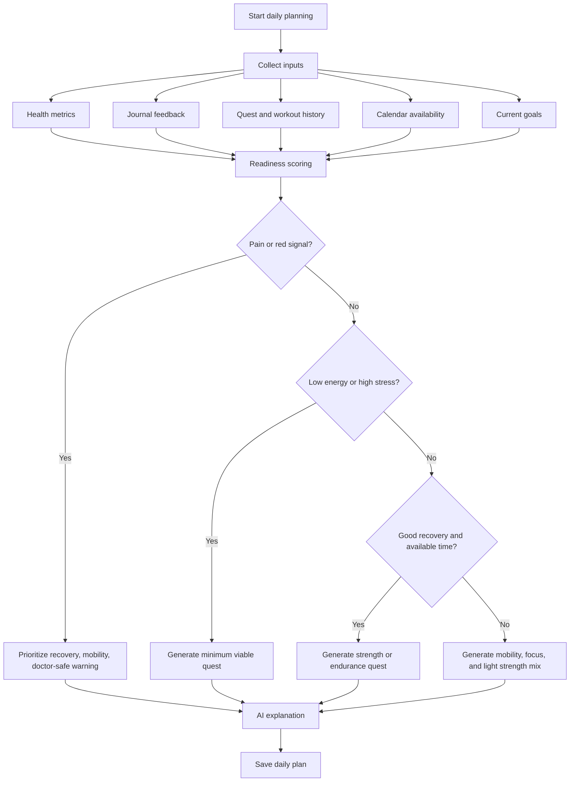

## Quest lifecycle

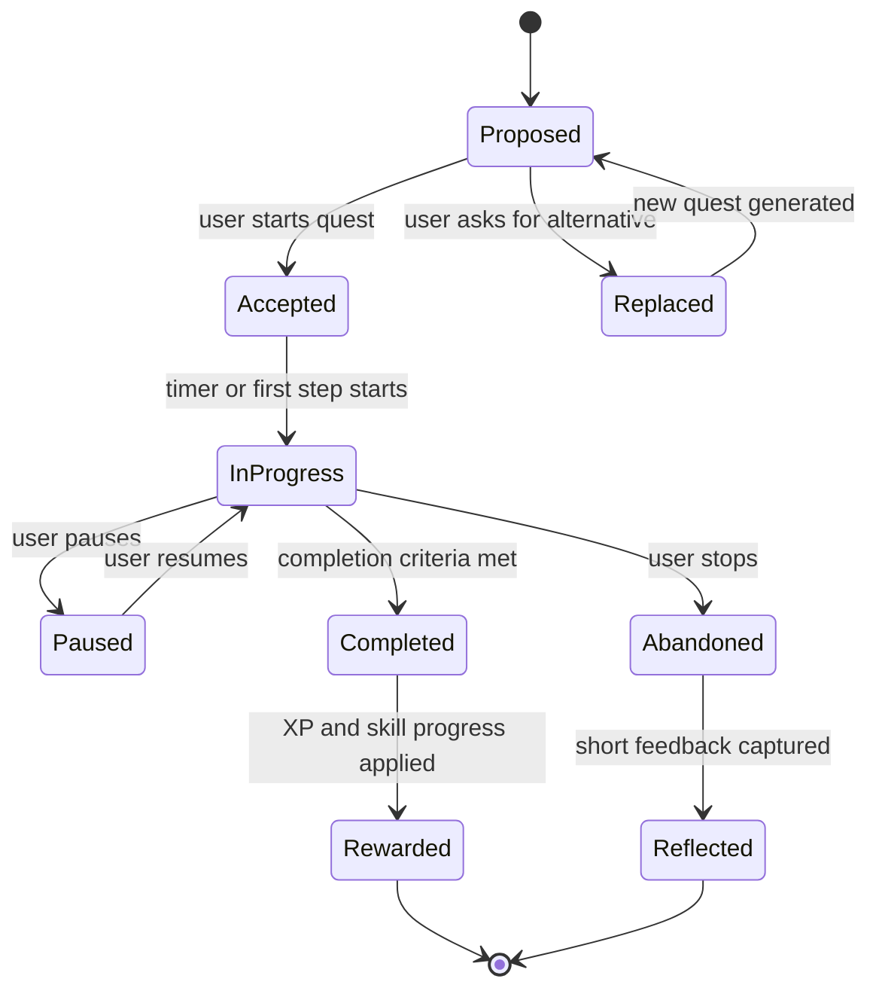

## Guided workout execution

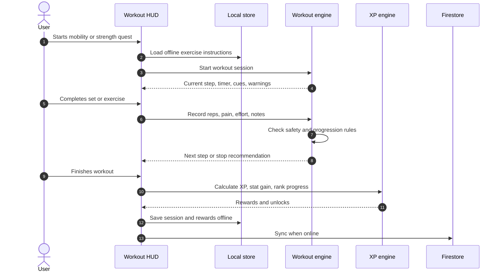

## Journal and mentor feedback

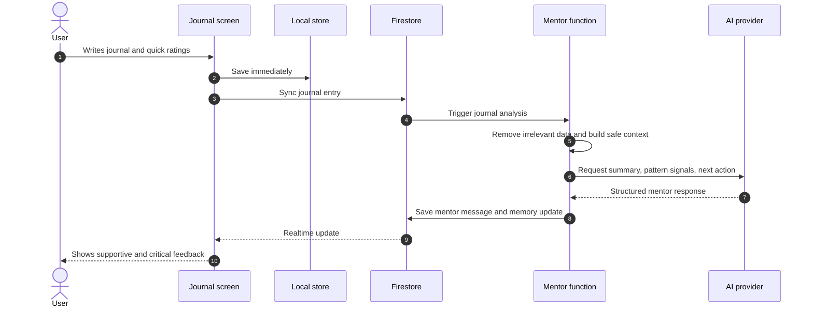

## Health data import flow

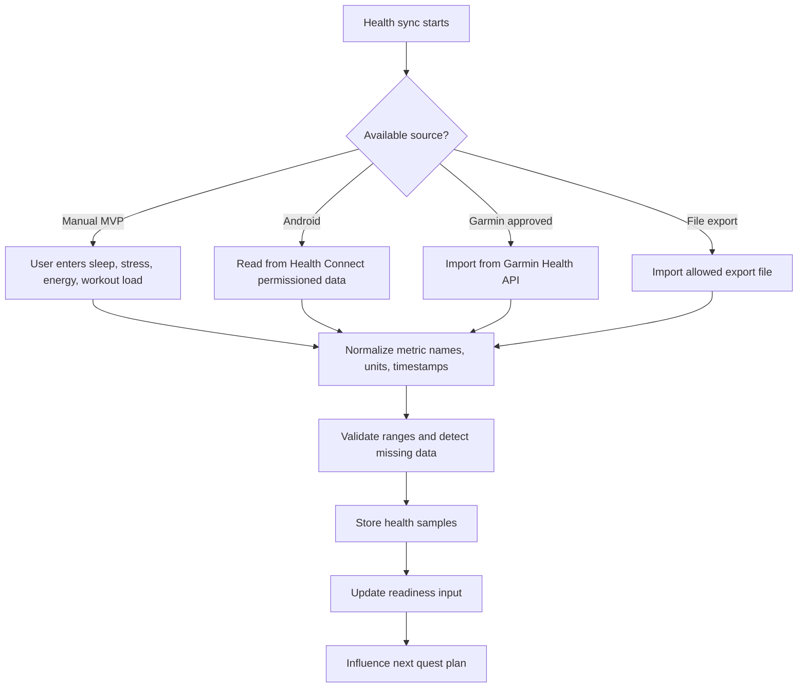

## Calendar sync flow

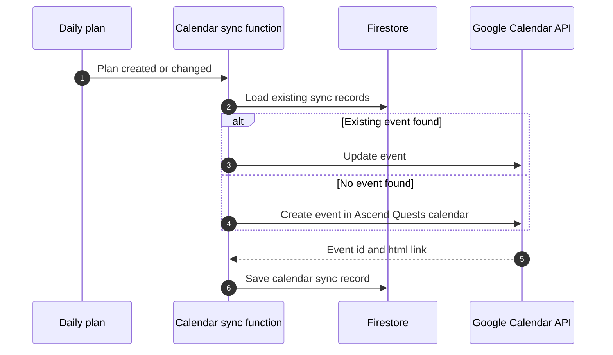

## AI mentor decision boundaries

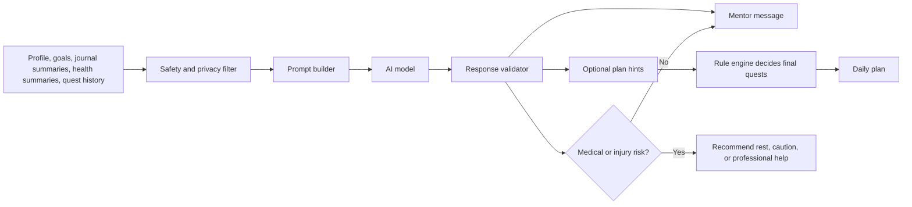

AI mentor sme predlagati in razloziti. Koncne naloge v MVP potrdi rule engine, da je obnasanje predvidljivo in testabilno.

## Biomarker future flow

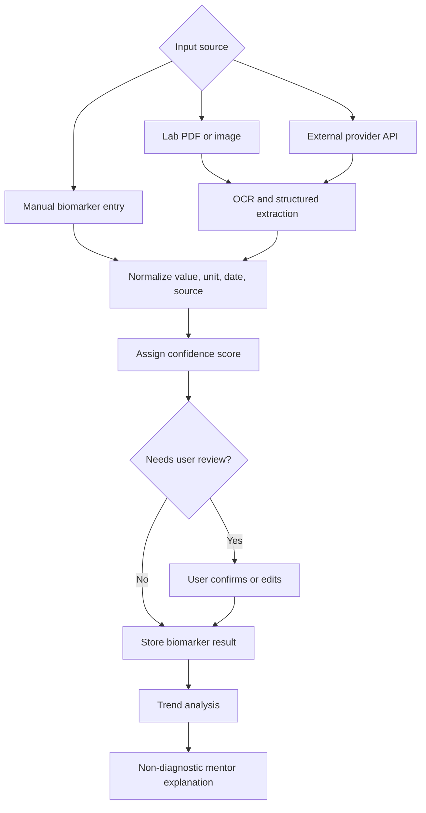

## MVP implementation order

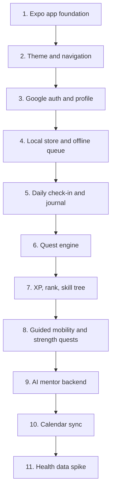

## Najbolj kriticne odlocitve pred kodo

1. Potrditi Firebase kot MVP oblak.
2. Izbrati Garmin/Health Connect prvo integracijsko pot po preverjanju tvojega telefona in ure.
3. Izbrati ton mentorja.
4. Dati ime ali link referencne Google Play aplikacije.
5. Potrditi, ali zacetne vodene vaje temeljijo na tekstu, slikah/animacijah ali videu.
