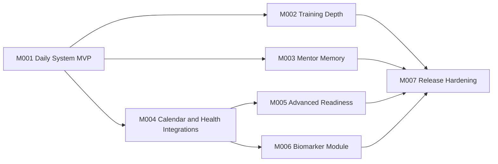

# Ascend System - Milestones

## Namen

Ta dokument razdeli produktni plan in arhitekturo v izvedbene milestone-e. Vsak milestone mora dostaviti nekaj demoable, ne samo plast kode. Podrobno razbit prvi milestone je v `.gsd/milestones/M001/`.

## Milestone overview

| Milestone | Ime | Namen | Status |
| --- | --- | --- | --- |
| M001 | Daily System MVP | Od prazne mape do delujocega osebnega daily system prototipa z loginom, check-inom, quest planom, XP/ranki, vodenimi vajami, AI mentor fallbackom in prvim sync slojem. | Planned |
| M002 | Training Depth | Razsiriti exercise library, mobility/strength progression, safety cues, animirane prikaze in offline vadbene protokole. | Planned |
| M003 | Mentor Memory | Narediti AI mentorja bolj osebnega: memory, tedenski review, pattern detection, ADHD coaching in bolj stabilne guardrails. | Planned |
| M004 | Calendar and Health Integrations | Stabilizirati Google Calendar sync, izbrati Health Connect/Garmin pot in avtomatizirati uvoz metrik. | Planned |
| M005 | Advanced Readiness | Dodati recovery-aware periodizacijo, overload opozorila, deload logiko in boljse planiranje treningov. | Planned |
| M006 | Biomarker Module | Raziskati in zgraditi blood work/pee test modul z rocnim vnosom, PDF/OCR potjo in ne-diagnosticnimi trendi. | Planned |
| M007 | Release Hardening | Varnost, privacy, backup/restore, testi, UI polish, rank-up animacije in priprava na realno uporabo. | Planned |

## Current focus

Trenutni fokus je **M001 - Daily System MVP**.

Dokumenti:

- `.gsd/milestones/M001/M001-CONTEXT.md`
- `.gsd/milestones/M001/M001-ROADMAP.md`
- `.gsd/milestones/M001/M001-TASKS.md`

## Dependency line

## Milestone rules

- Vsak milestone mora imeti jasen demo.
- Slice mora rezati cez relevantne plasti: UI, domain logiko, podatke, sync in test.
- Integracijske neznanke naj se dokazujejo zgodaj z ozkim adapterjem ali fallbackom.
- Health in dnevnik podatki so obcutljivi; z njimi ravnamo kot s privacy-critical funkcionalnostjo.
